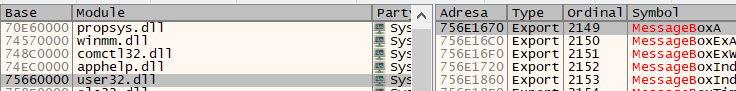

# 🛡️ Windows x86 Buffer Overflow PoC

This repository demonstrates a classic stack-based buffer overflow exploit on 32-bit Windows. It uses a vulnerable C program to execute a custom shellcode payload that triggers a Windows Message Box.

## 🛠️ Project Components
Understanding the exploit requires looking at both source files:
* `messageBox.asm` (The Blueprint): Defines the malicious logic. Assembly is used because shellcode requires total control over registers ($ebx$, $eax$, etc.) and the stack.
* `exploit.c` (The Delivery Truck): Generates the "poisoned" hex string. It handles the 32-byte padding, the return address overwrite, and the injection of raw opcodes.

## 🔍 Phase 1: Manual Address Discovery
Before compiling, you must find where `user32.dll` and `kernel32.dll` are mapped on **your** system. These addresses vary between Windows builds.

### 1. Using x32dbg to Find Symbols
1. Open **x32dbg**.
2. Load `C:\Windows\System32\mspaint.exe` (this ensures the necessary system DLLs are mapped).
3. Navigate to the **Symbols** tab.
4. Search for these functions and note their **Address**:

| Function | Module | Example Address (Found) |
| :--- | :--- | :--- |
| `MessageBoxA` | `user32.dll` | `0x756E1670` |
| `ExitProcess` | `kernel32.dll` | *[Locate in x32dbg]* |

### 2. Identifying the Target



Based on the provided debug session, `user32.dll` is loaded at base `75660000`, placing the `MessageBoxA` export at:
> `0x756E1670`

## 🧠 Phase 2: Understanding & Updating the Payload
The exploit uses **opcodes** (machine code) to communicate with the CPU. You must manually update these in `exploit.c` and `messageBox.asm`.

### The `\xBB` (MOV EBX) Instruction
The byte `\xBB` tells the CPU: *"Take the next 4 bytes and move them into the EBX register."* We use this to point the CPU to the Windows API functions we found in Step 1.

### Little-Endian Byte Order
x86 processors use **Little-Endian**, meaning multi-byte addresses must be stored in **reverse byte order**.

```c
// Updated instruction in exploit.c:
printf("\xBB\x70\x16\x6E\x75"); // mov ebx, 0x756E1670
```

## 🏗️ Phase 3: Building the Target
Modern Windows uses ASLR and DEP to block this. We must compile `vulnerable.c` with these protections **disabled**.

### Compile via MSVC (Developer Command Prompt)
```batch
# 1. Compile the object file (disable Stack Canaries)
cl /c /GS- /W3 /Zl vulnerable.c

# 2. Link the executable (disable ASLR and DEP)
link /SUBSYSTEM:CONSOLE /DYNAMICBASE:NO /NXCOMPAT:NO vulnerable.obj /OUT:vulnerable.exe
```

## 🚀 Phase 4: Execution
1. Compile your updated `exploit.c` and run it to generate the payload string.
2. Run `vulnerable.exe`.
3. When prompted, paste the payload string.
4. **Result:** The execution flow is hijacked, and a Message Box titled **"CAN I HACK THE PC?"** appears.

## ⚠️ Educational Disclaimer
This project is for educational purposes only. It demonstrates the fundamental mechanics of memory corruption to show why modern mitigations like ASLR and DEP are critical for security.